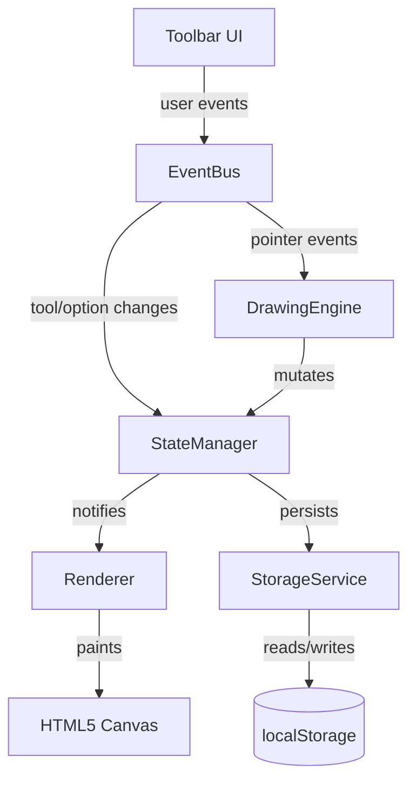

# Design Document: Whiteboard Sketch App

## Overview

A browser-only whiteboard application built with vanilla HTML5, CSS, and JavaScript (no framework required). All drawing is performed on an HTML5 `<canvas>` element using the 2D rendering context. The app supports freehand drawing, an eraser, stroke customization, undo/redo, clear canvas, local-storage persistence, and PNG export.

The architecture is intentionally simple: a single-page application with a flat module structure. State is managed in a central `AppState` object; rendering is driven by replaying the stroke history onto the canvas.

## Architecture



Key design decisions:
- **Replay-based rendering**: The canvas is redrawn from scratch by replaying all strokes whenever state changes. This makes undo/redo trivial (just slice the history array) and keeps the state model simple.
- **Pointer Events API**: A single set of `pointerdown / pointermove / pointerup` listeners handles mouse, touch, and stylus uniformly.
- **No external dependencies**: Keeps the app self-contained and instantly runnable from a static file server or `file://`.

## Components and Interfaces

### AppState

Central state object (plain JS object, not a class):

```ts
interface AppState {
  strokes: Stroke[];          // committed stroke history
  redoStack: Stroke[];        // strokes available for redo
  activeStroke: Stroke | null; // stroke currently being drawn
  activeTool: 'pen' | 'eraser';
  strokeColor: string;        // CSS color string, e.g. "#000000"
  strokeWidth: number;        // pixels
}
```

### DrawingEngine

Handles pointer events and builds strokes in real time.

```ts
interface DrawingEngine {
  onPointerDown(event: PointerEvent): void;
  onPointerMove(event: PointerEvent): void;
  onPointerUp(event: PointerEvent): void;
}
```

- On `pointerdown`: creates a new `activeStroke` with current tool/color/width.
- On `pointermove`: appends the point to `activeStroke` and triggers an incremental render.
- On `pointerup`: commits `activeStroke` to `strokes`, clears `redoStack` if tool is pen, persists state.

### Renderer

Redraws the canvas from the stroke history.

```ts
interface Renderer {
  render(state: AppState): void;
}
```

Rendering algorithm:
1. Clear the canvas.
2. For each stroke in `strokes`, replay its points using `lineTo` / `arc` with the stroke's saved color, width, and tool.
3. If `activeStroke` is non-null, render it on top (in-progress stroke).

Eraser strokes use `ctx.globalCompositeOperation = 'destination-out'` so they punch through to transparency.

### StateManager

Owns `AppState` and exposes mutation methods:

```ts
interface StateManager {
  getState(): AppState;
  commitStroke(stroke: Stroke): void;
  undo(): void;
  redo(): void;
  clearCanvas(): void;
  setTool(tool: 'pen' | 'eraser'): void;
  setColor(color: string): void;
  setStrokeWidth(width: number): void;
}
```

`clearCanvas()` pushes a sentinel `ClearStroke` onto `strokes` so the clear is undoable.

### StorageService

```ts
interface StorageService {
  save(strokes: Stroke[]): void;
  load(): Stroke[] | null;
}
```

Serializes `strokes` to JSON and writes to `localStorage` under a fixed key (`wsa_strokes`). Called after every state mutation.

### ToolbarController

Reads DOM events from toolbar controls and calls `StateManager` methods. Also subscribes to state changes to update active-tool highlight and enable/disable undo/redo buttons.

### ExportService

```ts
interface ExportService {
  exportPNG(canvas: HTMLCanvasElement): void;
}
```

Uses `canvas.toDataURL('image/png')` and triggers a programmatic `<a download>` click.

## Data Models

### Stroke

```ts
interface Stroke {
  id: string;               // uuid or timestamp-based id
  tool: 'pen' | 'eraser' | 'clear';
  color: string;            // ignored for eraser/clear
  width: number;            // ignored for clear
  points: Point[];          // ordered list of pointer positions
}

interface Point {
  x: number;
  y: number;
}
```

A `clear` sentinel stroke has `tool: 'clear'` and an empty `points` array. During replay, when the renderer encounters a `clear` stroke it calls `ctx.clearRect(...)` to wipe everything drawn so far.

### Persistence Format

Strokes are serialized as a JSON array and stored under the key `wsa_strokes` in `localStorage`. On load, the array is parsed and used to initialize `AppState.strokes`.

```json
[
  {
    "id": "1700000000000",
    "tool": "pen",
    "color": "#e63946",
    "width": 4,
    "points": [{"x": 10, "y": 20}, {"x": 15, "y": 25}]
  }
]
```


## Correctness Properties

*A property is a characteristic or behavior that should hold true across all valid executions of a system — essentially, a formal statement about what the system should do. Properties serve as the bridge between human-readable specifications and machine-verifiable correctness guarantees.*

### Property 1: Stroke commitment captures tool, color, width, and points

*For any* pointer-down / pointer-move sequence followed by pointer-up, the stroke committed to `AppState.strokes` shall have the same `tool`, `color`, `width`, and ordered `points` array that were active at the time of drawing.

**Validates: Requirements 1.1, 1.2, 2.2, 2.3**

### Property 2: Option changes apply to all subsequent strokes

*For any* color or stroke-width value set via `StateManager`, every stroke committed after that change shall carry that exact color or width value; strokes committed before the change shall be unaffected.

**Validates: Requirements 3.3, 3.4**

### Property 3: Undo/redo round trip

*For any* non-empty strokes history, calling `undo()` followed by `redo()` shall restore `AppState.strokes` to its original contents in the original order.

**Validates: Requirements 4.1, 4.2**

### Property 4: Empty history disables undo/redo controls

*For any* app state where `strokes` is empty, the undo control shall be disabled; *for any* state where `redoStack` is empty, the redo control shall be disabled.

**Validates: Requirements 4.3, 4.4**

### Property 5: New stroke after undo clears redo stack

*For any* state with a non-empty `redoStack`, committing a new pen or eraser stroke shall result in `redoStack` being empty.

**Validates: Requirements 4.5**

### Property 6: Clear canvas is undoable

*For any* strokes history H, calling `clearCanvas()` then `undo()` shall restore `AppState.strokes` to H.

**Validates: Requirements 5.2, 5.3**

### Property 7: Persistence round trip

*For any* strokes array, serializing it via `StorageService.save()` then deserializing via `StorageService.load()` shall produce a structurally equivalent array (same strokes, same points, same order). When no data is stored, `load()` shall return `null` and the app shall initialize with an empty strokes array.

**Validates: Requirements 6.1, 6.2, 6.3**

### Property 8: Export preserves canvas dimensions

*For any* canvas element, the PNG data URL produced by `ExportService.exportPNG()` shall decode to an image whose width and height equal the canvas's `width` and `height` attributes.

**Validates: Requirements 7.3**

## Error Handling

| Scenario | Handling |
|---|---|
| `localStorage` quota exceeded on save | Catch `QuotaExceededError`, log a warning, continue without persisting (no crash) |
| `localStorage` contains malformed JSON on load | Catch parse error, fall back to blank canvas state |
| `canvas.toDataURL()` throws (e.g., tainted canvas) | Catch error, show a user-facing alert |
| Pointer events fire without a prior `pointerdown` (e.g., mid-drag page load) | Guard: ignore `pointermove` / `pointerup` when `activeStroke` is null |
| Undo called on empty history | No-op; undo button is disabled so this should not occur, but guard defensively |
| Redo called on empty redo stack | No-op; same defensive guard |

## Testing Strategy

### Dual Testing Approach

Both unit tests and property-based tests are required and complementary.

- **Unit tests** cover specific examples, integration points, and edge cases.
- **Property-based tests** verify universal properties across randomly generated inputs.

### Property-Based Testing

Use **fast-check** (JavaScript) as the property-based testing library. Each property test must run a minimum of **100 iterations**.

Each test must be tagged with a comment in this format:
```
// Feature: whiteboard-sketch-app, Property <N>: <property_text>
```

Property test mapping:

| Design Property | Test description |
|---|---|
| Property 1 | Generate random point sequences and tool/color/width combos; verify committed stroke fields |
| Property 2 | Generate random color/width changes interleaved with strokes; verify each stroke carries the active option at commit time |
| Property 3 | Generate random stroke histories; undo then redo and assert strokes array is identical |
| Property 4 | Generate states with empty strokes / empty redoStack; assert correct button disabled state |
| Property 5 | Generate states with non-empty redoStack; commit a new stroke; assert redoStack is empty |
| Property 6 | Generate random stroke histories; clearCanvas then undo; assert strokes restored |
| Property 7 | Generate random stroke arrays; save then load; assert structural equality (round trip) |
| Property 8 | Generate canvas sizes; export; decode data URL; assert image dimensions match |

### Unit Tests

Focus on:
- Toolbar renders with pen, eraser, color picker, width options, clear, export, undo, redo controls (Requirements 2.1, 3.1, 3.2, 5.1, 7.1)
- Export triggers a download with a `.png` filename (Requirement 7.2)
- Edge case: `StorageService.load()` returns `null` when localStorage is empty → blank canvas (Requirement 6.3)
- Edge case: malformed JSON in localStorage → blank canvas fallback
- Edge case: undo/redo no-ops when history/redo stack is empty
