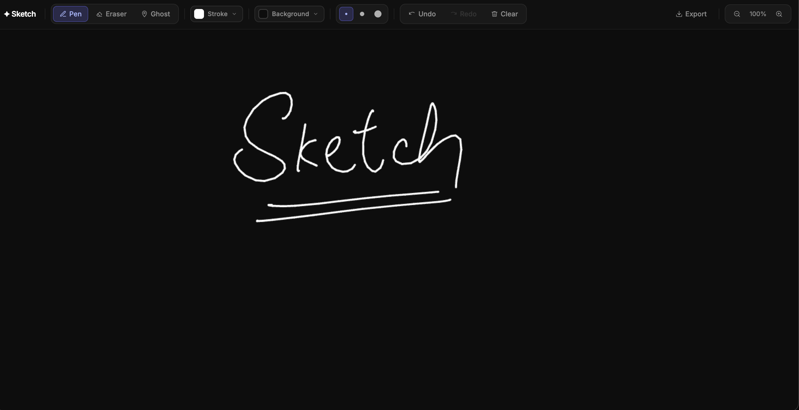

# ✦ Sketch

A browser-only infinite whiteboard built with vanilla HTML5, CSS, and JavaScript. No framework, no build step — open `index.html` and draw.



---

## Features

| Feature | Details |
|---|---|
| **Pen tool** | Pressure-sensitive strokes — real stylus pressure or velocity-simulated for mouse |
| **Eraser tool** | Stroke-level eraser — removes whole strokes on contact, not pixels |
| **Ghost tool** | Ephemeral strokes that glow and fade after you stop drawing — great for presentations |
| **Infinite canvas** | Pan with middle-mouse / Space+drag / two-finger touch; zoom with scroll wheel or pinch |
| **Stroke customisation** | Color picker (gradient + hue slider + hex input + presets), three width sizes |
| **Background color** | Separate color picker for the canvas background |
| **Undo / Redo** | Full history with keyboard shortcuts |
| **Clear canvas** | Undoable clear action |
| **Export PNG** | Downloads the current canvas at full resolution |
| **Persistence** | Strokes auto-saved to `localStorage` and restored on reload |

---

## Getting started

No build step required. Serve the project root with any static file server:

```bash
# Node
npx serve .

# Python
python3 -m http.server

# VS Code
# Install the "Live Server" extension and click "Go Live"
```

Then open `http://localhost:3000` (or whatever port your server uses).

---

## Keyboard shortcuts

| Key | Action |
|---|---|
| `P` | Pen tool |
| `E` | Eraser tool |
| `G` | Ghost tool (toggle) |
| `Space` + drag | Pan canvas |
| `Scroll` | Zoom in / out |
| `Ctrl+Z` / `Cmd+Z` | Undo |
| `Ctrl+Y` / `Cmd+Y` | Redo |
| `Ctrl+0` / `Cmd+0` | Reset zoom to 100% |

---

## Project structure

```
├── index.html              # Single-page app shell + toolbar UI + color picker
└── src/
    ├── main.js             # Bootstrap: wires all modules, handles pan/zoom/pointer events
    ├── types.js            # JSDoc typedefs + factory helpers (AppState, Stroke, Point)
    ├── StateManager.js     # Owns AppState — undo/redo/clear/tool/color/width mutations
    ├── DrawingEngine.js    # Pointer event → world-space stroke points + pressure simulation
    ├── Renderer.js         # Replay-based canvas renderer with variable-width stroke drawing
    ├── GhostEngine.js      # Ephemeral ghost strokes on an overlay canvas with fade animation
    ├── Viewport.js         # Pan/zoom transform (world ↔ screen coordinate mapping)
    ├── CursorManager.js    # SVG data-URI cursors that match the active tool and color
    ├── StorageService.js   # localStorage persistence (save/load strokes as JSON)
    ├── ExportService.js    # PNG export via canvas.toDataURL + programmatic <a download>
    └── ToolbarController.js # Wires toolbar DOM events to StateManager methods
```

### Architecture overview

```
Toolbar UI ──► ToolbarController ──► StateManager ──► Renderer ──► Canvas
                                          │
Pointer events ──► DrawingEngine ─────────┘         StorageService ──► localStorage
                        │
                   Viewport (pan/zoom transform)

Ghost tool ──► GhostEngine ──► Overlay Canvas (separate, never touches AppState)
```

Key design decisions:

- **Replay-based rendering** — the canvas is cleared and all strokes replayed on every state change. Undo/redo is just slicing the history array.
- **World-space coordinates** — strokes are stored in world space. The viewport transform is applied at render time, so pan/zoom never mutates stroke data.
- **Offscreen baking** — ghost strokes are baked to `OffscreenCanvas` once on commit. Fading is a single `drawImage` + `globalAlpha` per frame regardless of stroke complexity.

---

## Running tests

```bash
npm test
```

73 tests across unit, property-based (fast-check), and integration suites covering all core modules.

---

## Browser support

Any modern browser with support for:
- Pointer Events API (mouse, touch, stylus)
- HTML5 Canvas 2D
- ES Modules
- `OffscreenCanvas` (for ghost tool baking)
